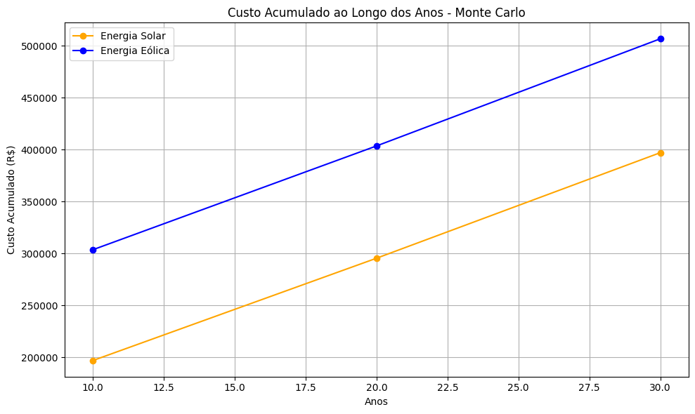
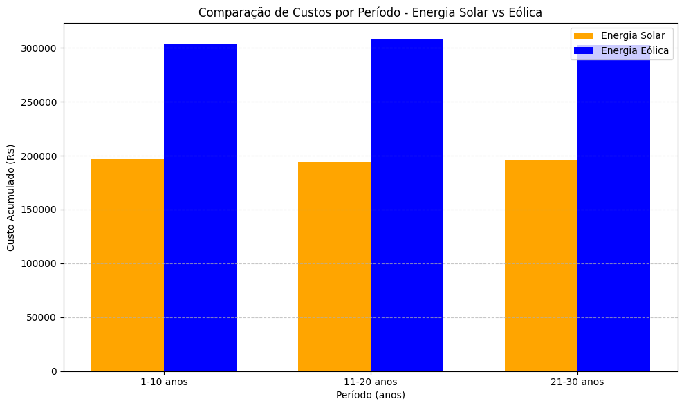
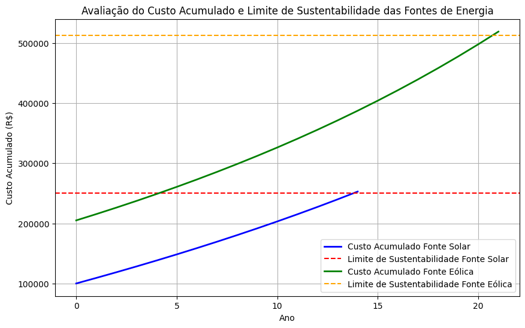

## Global Solution - Dynamic Programming
 
**Nomes + RM dos integrantes:**
- Guilherme Akio - 98582
- Fabrício Saavedra - 97631
 
**Turma:** 2ESPW
 
**Ano:** 2024
___ 
## Descrição do Projeto
Este projeto oferece insights valiosos sobre o impacto econômico de investimentos em energias renováveis, tomando como exemplo a energia solar e eólica, em cenários de longo prazo. Ele combina eficiência e precisão no cálculo dos custos, utilizando diferentes técnicas, como **Monte Carlo**, para calcular e comparar os custos acumulados de ambas as fontes de energia ao longo de diversos períodos. Além disso, a **Memoização** é aplicada para otimizar o tempo de execução, enquanto as abordagens de **Dividir para Conquistar** e **Recursão** são utilizadas para estruturar o cálculo de maneira eficiente.

## Bibliotecas Utilizadas

- `numpy`: para cálculos matemáticos e geração de números aleatórios.
- `pandas`: para manipulação e análise de dados.
- `matplotlib`: para visualização gráfica dos resultados.
- `time`: para medição de tempo de execução das funções.

## 1. Simulação de Custo ao Longo do Tempo (Monte Carlo)

### Funções Usadas e Objetivo

- **`monte_carlo`**: Calcula o custo acumulado ao longo de diferentes períodos (10, 20 e 30 anos) com base em variações estocásticas de inflação.
- Objetivo: Avaliar como os custos de energia solar e eólica se comportam ao longo do tempo sob cenários variados.

### Resultado

### Conclusões

A partir das variações de custos acumulados ao longo do tempo, a análise gráfica e tabular mostra que, em todos os cenários de 10, 20 e 30 anos, a energia solar se mantém como a fonte de energia mais viável. Isso ocorre porque, ao considerar os parâmetros de custo inicial, custo de manutenção anual e tarifa anual, a energia solar apresenta um custo acumulado mais baixo em comparação com a energia eólica. Ao longo dos anos, o custo acumulado da energia solar cresce de forma mais controlada, mantendo-se abaixo do valor de energia eólica, que já ultrapassa os custos da solar desde o primeiro ano.

## 2. Comparação de Fontes com Dividir para Conquistar

### Funções Usadas e Objetivo

- **`dividir_para_conquistar`**: Avalia os custos acumulados por períodos (1-10 anos, 11-20 anos, e 21-30 anos) de forma segmentada.
- Objetivo: Comparar os custos entre as fontes de energia em intervalos menores, facilitando a análise detalhada.

### Resultado

### Conclusões

Ao utilizar a técnica de Dividir para Conquistar, podemos estruturar a análise de custos acumulados ao longo de períodos distintos (1-10 anos, 11-20 anos e 21-30 anos). Esse método permite avaliar de forma clara como os custos de cada fonte de energia se distribuem ao longo do tempo e qual delas se mantém mais econômica.

- **1-10 anos**: A energia solar tem um custo acumulado de R$196,783.01, enquanto a energia eólica apresenta R$303,274.97, o que já mostra uma diferença significativa em favor da solar.
- **11-20 anos**: A energia solar mantém-se abaixo de R$200,000, com um custo de R$194,546.66, enquanto a energia eólica continua com um custo acumulado mais alto, R$307,964.68.
- **21-30 anos**: A energia solar tem um custo de R$196,194.87, ligeiramente maior que no período anterior, mas ainda mais vantajosa comparada à energia eólica, que permanece mais cara com R$302,497.94.

## 3. Economia com Memoization

### Funções Usadas e Objetivo

- **`memoization`**: Reduz o tempo de execução armazenando resultados intermediários de cálculos recorrentes.
- Objetivo: Demonstrar como a técnica pode melhorar a eficiência de cálculos em cenários complexos.

### Resultado

### Conclusões

A memoização ajuda a evitar o cálculo repetitivo de subproblemas, armazenando os resultados intermediários e reutilizando-os em cálculos subsequentes, o que reduz o tempo necessário para processar os dados.

Em todos os exemplos (simulando 5, 15, 25 e 35 anos), o tempo de execução foi drasticamente reduzido com o uso da memoização. A eficiência de memoização variou entre 53% a 79%, indicando uma aceleração considerável no cálculo dos custos acumulados. A técnica não teve grande impacto no valor final do custo acumulado. Em alguns casos, houve uma leve variação nos custos, mas ela foi mínima e não afetou substancialmente a análise comparativa entre as fontes de energia.

## 4. Avaliação Recursiva de Tarifas e Horizonte Temporal

### Funções Usadas e Objetivo

- **`avaliacao_recursiva`**: Analisa a viabilidade econômica com base em um teto de custo definido.
- Objetivo: Determinar até quando cada fonte de energia se mantém viável com base nos custos acumulados.

### Resultado

 

### Conclusões

A análise de viabilidade econômica se baseia no conceito de teto de custo tolerável, que neste exercício foi definido como 2,5 vezes o custo inicial. Usando esse teto, é possível determinar até quando cada fonte de energia se mantém viável.

- **Fonte Solar**: A energia solar se torna inviável no ano 13, pois o custo acumulado ultrapassa 2,5 vezes o custo inicial. Isso indica que, após 13 anos, a energia solar não seria mais uma opção economicamente viável sem ajustes.
- **Fonte Eólica**: A energia eólica, apesar de ter um custo inicial mais alto, se torna inviável no ano 20, mostrando que ela possui um horizonte de viabilidade mais longo que a solar.

A partir dessa análise, podemos perceber que seria necessário ajustar as tarifas de energia para manter a viabilidade econômica das fontes de energia. Por exemplo, se as tarifas forem reduzidas em 50% para ambas as fontes, a viabilidade pode ser estendida em até 5 anos para cada uma das fontes, o que permitiria que tanto a energia solar quanto a energia eólica se mantivessem viáveis por mais tempo, adiando o ponto em que se tornariam inviáveis economicamente.

## Referências

- [Custo de manutenção energia solar](https://elysia.com.br/manutencao-de-painel-fotovoltaico)
- [Custo de manutenção energia eólica](https://www.maxwell.vrac.puc-rio.br/22813/22813_5.PDF)
- [Custo de instalação](https://www.ecycle.com.br/eolica-ou-solar)
